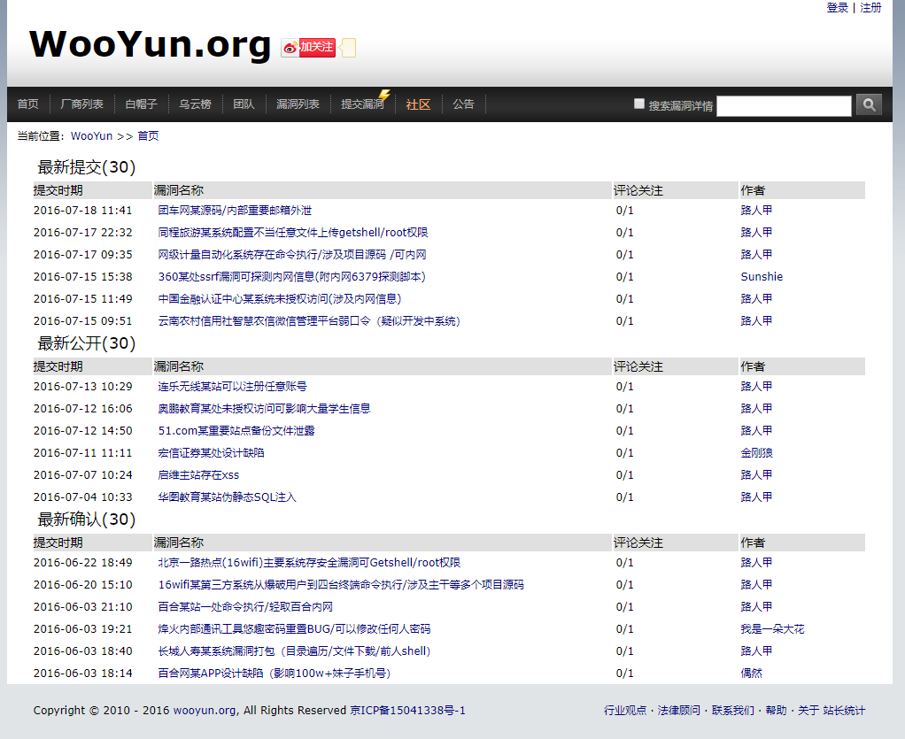
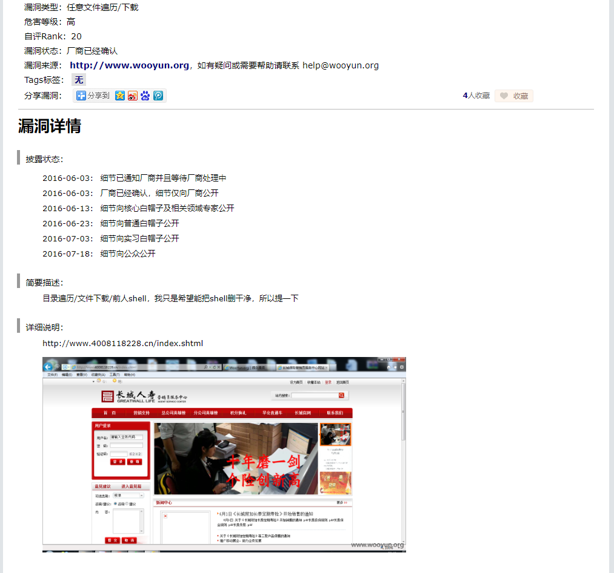

# wooyun_final
V7hinc/wooyun_final GitHub链接：https://github.com/V7hinc/wooyun_final
>代码主要来自于[hanc00l的wooyun_public的wooyun_final](https://github.com/hanc00l/wooyun_public)
漏洞信息来自于[m0l1ce的wooyun_all_bugs_8.8W](https://github.com/m0l1ce/wooyunallbugs)，包含8.8W漏洞信息（不含知识库）
支持
+ 支持多关键字搜索和在漏洞详情中搜索
+ 漏洞详情图片支持相对路径读取本地图片
+ 代码适应PHP5.6

源码需在lamp环境下运行，拉取[源码V7hinc/wooyun_final](https://github.com/V7hinc/wooyun_final) 到网站根目录，
下载[wooyun数据库wooyun_bugs_db.tar.bz2
](https://github.com/V7hinc/wooyun_final/releases/tag/1.0) 文件解压到MySQL文件路径下wooyun文件夹

# Docker搭建wooyun
Dockerfile构建方法
```shell script
docker build -t v7hinc/wooyun github.com/V7hinc/wooyun_final
```
或者直接拉取已经生成的docker镜像
```shell script
docker pull v7hinc/wooyun
```
创建新的容器
> 由于wooyun的图片占容量较大，所以在Dockerfile中加了VOLUME挂载卷，不至于把容器撑的很大

2种挂载方法（这个地方容易有坑）
> 1、不指定宿主机挂载目录
```shell script
docker run --name wooyun -p 5000:80 -dit v7hinc/wooyun:latest /bin/bash
# 创建好容器后查看挂载位置，cd进入查询结果"Source"后面的路径,就是对应容器中upload的路径
[root@localhost ~]# docker inspect wooyun | grep "Source"
                "Source": "/var/lib/docker/volumes/21313d9e09fd3b571ae1daab856d07012f2081c940a9d839c121fa62f7f43764/_data",
```
> 2、指定宿主机挂载目录
```shell script
docker run --privileged=true --name wooyun -v ~/upload:/home/wwwroot/default/upload -p 5000:80 -dit v7hinc/wooyun:latest /bin/bash
```
>到此wooyun漏洞库已经还原好了。可以通过访问http://IP:5000访问到了
>但是会发现打开漏洞详情图片看不了
>接下来需要下载图片资源，然后解压到docker宿主机的~/upload目录下就可以看到图片了，如果是采用不指定宿主机挂载目录则解压到"Source"对应的路径即可

百度网盘下载链接: https://pan.baidu.com/s/1cadRdAC5Cxb1M_o5URNXSw 提取码: tkqg

效果图 Nice：



#### 容器内相关软件安装目录
```
Apache目录：/usr/local/apache/
MariaDB 目录 : /usr/local/mariadb/
MariaDB数据库所在目录：/usr/local/mariadb/var/
PHP目录 : /usr/local/php/
默认网站目录 : /home/wwwroot/default/
```
#### 容器内相关配置文件位置
```
Apache配置文件：/usr/local/apache/conf/httpd.conf
Apache虚拟主机配置文件目录：/usr/local/apache/conf/vhost/
Apache默认虚拟主机配置文件：/usr/local/apache/conf/extra/httpd-vhosts.conf
虚拟主机配置文件名称：/usr/local/apache/conf/vhost/域名.conf
MySQL配置文件：/etc/my.cnf
PHP配置文件：/usr/local/php/etc/php.ini
php-fpm配置文件：/usr/local/php/etc/php-fpm.conf
```

# 其它

+ 本程序只用于技术研究和个人使用，程序组件均为开源程序，漏洞和知识库来源于乌云公开漏洞，版权归wooyun.org。

